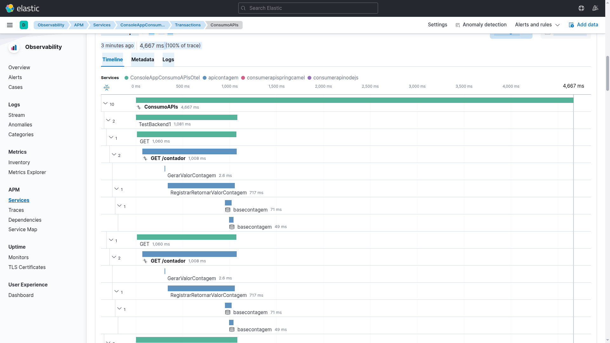

# dockercompose-opentelemetry-elasticapm-postgres-mysql-redis
Docker Compose + scripts para criação do ambiente de testes com os serviços de monitoramento do Elastic APM + OpenTelemetry e bases de dados do PostgreSQL, MySQL e Redis.

---

Exemplo de telemetria gerada utilizando o ambiente criado via Docker Compose:

